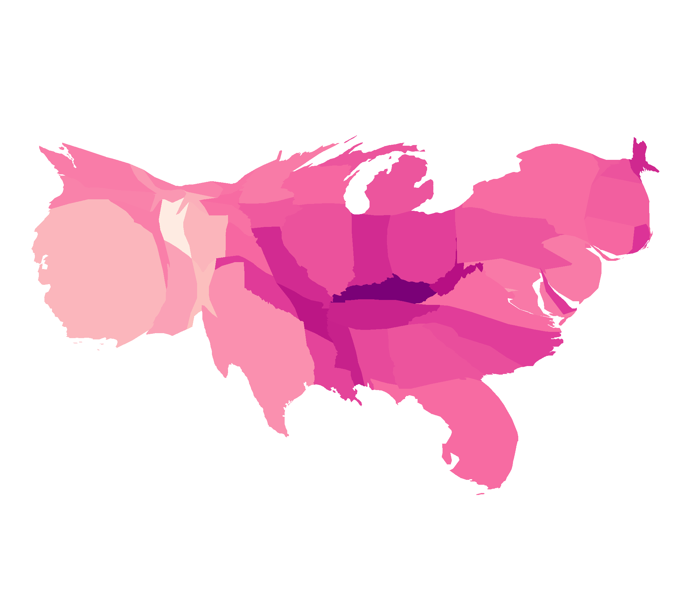
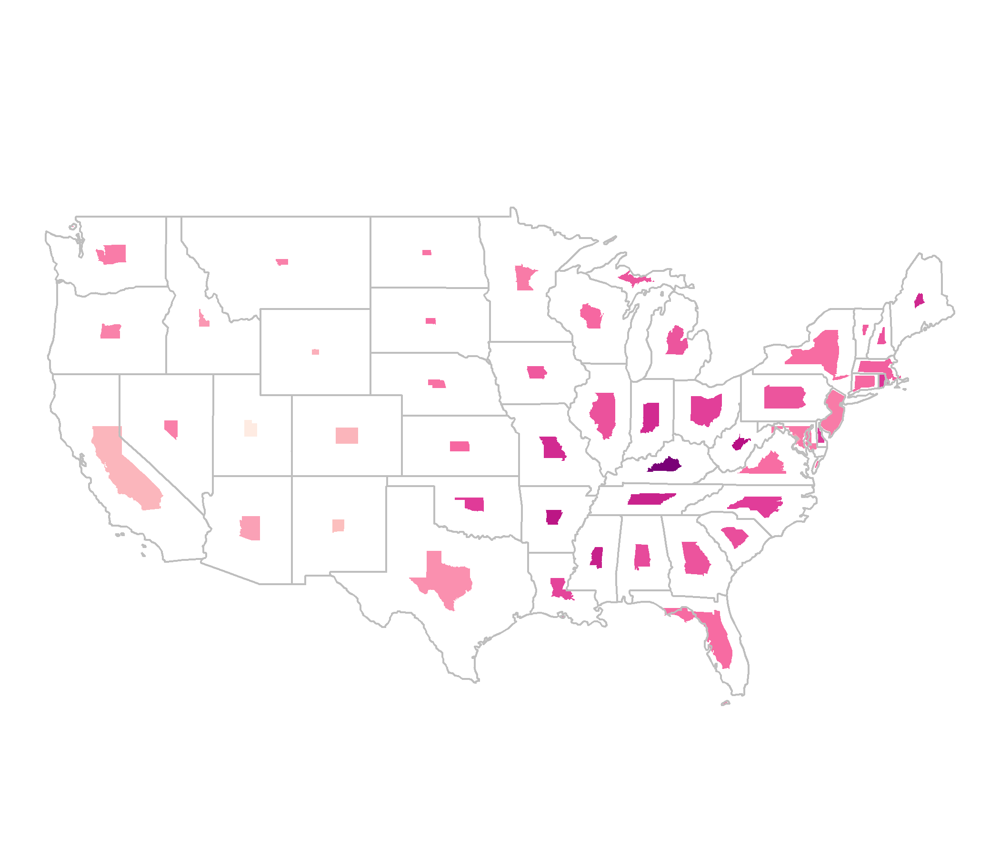
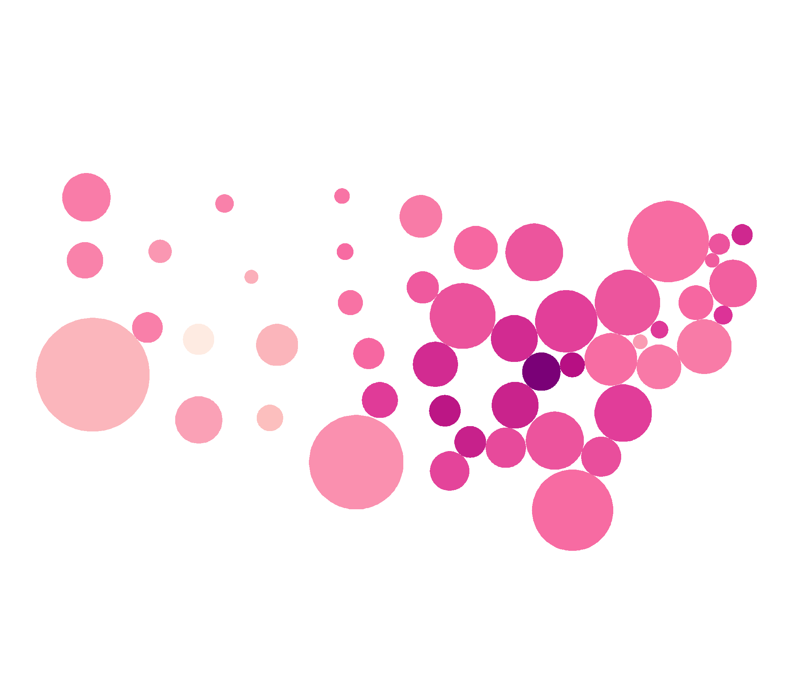

```{r setup, include=FALSE}
library(knitr)
library(icon)
library(tidyverse)
library(maps)
library(ggforce)
library(kableExtra)
library(sf)
options(htmltools.dir.version = FALSE)
knitr::opts_chunk$set(fig.retina = 3, 
                      echo = FALSE, 
                      warning = FALSE, 
                      message = FALSE, 
                      cache = TRUE)
```


---

class: top


# About me

### `r icon::fontawesome("twitter")` `r icon::fontawesome("github")` srkobakian

Master of Philosophy in Statistics (QUT)

Bachelor of Commerce, Bachelor of Economics

I live in Melbourne, Australia

???

I spent most of my masters researching map displays used in Cancer Atlases.
To explore the use of alternative displays, and select one that would work for Australia.

We couldn't find one that would really improve the choropleth map display

---

class: top, center, inverse


# Ask me a question

### Use the chat
### Answer in discussion time

???

Now there may have been some terms I used that are unfamiliar to you. And that is great because it means I may get to teach you something today.
So If you have a question during the talk, use the chat to send it through, we may answer it as the presentation continues but if we don't i'll address it in the discussion time.
 
---
class: top, center

# What can you do with ggplot2?

--

## Use the Grammar of Graphics to build visulisations


---

# What is the geom for mapping?

--

## This is not a simple question

## There are many types of maps

ggplot2: Elegant Graphics for Data Analysis:

[Chapter 6: Maps](https://ggplot2-book.org/maps.html)


???

This is not a simple question
There are many ways to map

What do we have to work with?


---

# What do we need to plot?


.pull-left[

Libraries
```{r libraries, echo = TRUE, message=FALSE}
library(ggplot2)
library(maps)
```

Data 
```{r mapdata, results = FALSE, echo = TRUE}
world <- map_data("world")

Australia <- world %>% filter(region == "Australia") 

Australia
```


]

.pull-right[


```{r mapdata1, echo = FALSE}
world <- map_data("world")

Australia <- world %>% filter(region == "Australia") 

Australia %>% head()
```

]

---

# Mapping Data

.pull-left[

```{r filteraus, echo = FALSE}
# remove islands down the bottom
Australia <- Australia %>% filter(lat > -45)
```

```{r auspoints,  fig.width = 6, fig.height = 5, dpi = 600, echo = TRUE}
  ggplot(Australia) + 
  geom_point(aes(x = long, y = lat))
```
]

.pull-right[

```{r ausline,  fig.width = 6, fig.height = 5, dpi = 600, echo = TRUE}
  ggplot(Australia) + 
  geom_line(aes(x = long, y = lat))
```

]

???

These points are what we need for a map.
But it is about how you use them.


---

# Polygon Mapping

.pull-left[

```{r auspolygon,  fig.width = 6, fig.height = 5, dpi = 600, echo = TRUE}
  ggplot(Australia) + 
  {{geom_polygon(aes(x = long, y = lat, group = group))}}
```
]

.pull-right[

### This is a great start
 
 - It looks like Australia!
 - Borders are clear
 - Islands are also clear
 
### How can we improve this?


]


???

Polygons are very similar to paths (as drawn by geom_path()) except that the start and end points are connected and the inside is coloured by fill. 

---

class: middle, center, inverse


# SF system

---

## Simple Features

### Key difference:

### geometry list-column

--
Converts many, many rows

into a single row per area


Geometries fit together,

like puzzle pieces


.footnote[
[2] https://r-spatial.github.io/sf/index.html
]

---

# ozmaps package

.pull-left[

```{r ozmapcountry1, echo = TRUE}
library(sf)
library(ozmaps)
sf_oz <- ozmap_data("country")
sf_oz %>% kable()

```


```{r ozmapcountry2, echo = TRUE, fig.show = 'hide'}
{{ggplot(sf_oz) + geom_sf()}}
```

]
.pull-right[


```{r ref.label = 'ozmapcountry2', fig.width = 6, fig.height = 4, dpi = 600, echo = FALSE, results = TRUE}

```
]

---
.pull-left[

```{r ozmapstates1}
library(ozmaps)
sf_states <- ozmap_data("states")
sf_states %>% kable()

```
]
.pull-right[

```{r ozmapstates2, echo = TRUE, fig.width = 6, fig.height = 4, dpi = 600}
sf_states <- ozmap_data("states")

ggplot(sf_states) + geom_sf()
```

]


---

class: middle, center, inverse

# Creating Choropleth maps

### A choropleth maps fills regions on the maps according to their data value

--

## We need two things:

### Map and Data


---

# Data: COVID LIVE Australia

```{r scrape, echo = TRUE}
{{library(rvest)}}
{{library(polite)}}

covid_url <- "https://covidlive.com.au/report/cases"

covid_data <- bow(covid_url) %>% 
  scrape() %>% 
  html_table() %>% 
  purrr::pluck(2) %>% 
  as_tibble()

covid_data
```


---


.pull-left[

# Data `r icon::fontawesome("check")`
```{r coviddatatable}
covid_data <- covid_data %>% select(-VAR) %>% replace_na()
covid_data %>% knitr::kable()
```
]
.pull-right[

# Map `r icon::fontawesome("check")`

```{r covidmaptable,  fig.width = 6, fig.height = 5, dpi = 600}
ozmap_states %>% knitr::kable()

```
]

---

# To join the Covid data to the map

--
.pull-left[
### - Expand the abbreviations so the names match
### - Convert cases to numeric values

```{r covidmutate, echo = TRUE}
covid_data <- covid_data %>% 
  mutate(STATE = case_when(
    # replace the abbreviations 
     STATE == "NSW" ~ "New South Wales",
     STATE == "WA" ~ "Western Australia",
     STATE == "SA" ~ "South Australia",
     STATE == "NT" ~ "Northern Territory",
     STATE == "ACT" ~ "Australian Capital Territory",
    # keep the rest of the state names
     TRUE ~ STATE )) %>% 
  
  mutate(CASES = parse_number(CASES))
```
]

.pull-right[

### - Peform a join

```{r statesjoin, echo = TRUE}
covid_states <- left_join(ozmap_states, covid_data,
                   by = c("NAME" = "STATE"))
```

### - Remove the "Other Territories"

```{r statesfilter, echo = TRUE}
covid_states <- covid_states %>% 
              filter(!(NAME == "Other Territories"))
```

]

---


.pull-left[

# Data `r icon::fontawesome("check")`

```{r coviddatatable1}
covid_data %>% knitr::kable()
```
]
.pull-right[

# Map `r icon::fontawesome("check")`

```{r covidmaptable1,  fig.width = 6, fig.height = 5, dpi = 600}
ozmap_states %>% knitr::kable()

```

]

---

.pull-left[

# Complete map data `r icon::fontawesome("check")`

```{r covidstatesdata}
covid_states %>% knitr::kable() %>% kable_styling(font_size = 12)
```
]
.pull-right[

# Choropleth Map `r icon::fontawesome("check")`

```{r covidmap,  echo = TRUE, fig.width = 6, fig.height = 5, dpi = 600}
  
ggplot(covid_states) + 
  geom_sf(aes(fill = CASES))

```
]


---


```{r auszoom2,  fig.width = 13, fig.height = 6, dpi = 600, echo = TRUE}
{{library(ggforce)}}

ggplot(covid_states) + 
  geom_sf(aes(fill = CASES)) +
  {{facet_zoom(xy = NAME == "Australian Capital Territory", zoom.size = 0.6)}}
```

---

class: inverse, center
# Off we go!


---

# Covid in Sri Lanka


.footnote[

https://covid19.gov.lk/wp-content/uploads/2021/02/sitrep-sl-en-18-02_10_21.pdf
]

---


### Data: Epidemiology Unit, Ministry of Health


```{r scrapeSL, echo = FALSE}
{{library(stringr)}}
# https://covid19.gov.lk/wp-content/uploads/2021/02/sitrep-sl-en-18-02_10_21.pdf
covid_sl_table <- c("COLOMBO26925GAMPAHA15669PUTTALAM1011KALUTARA5674ANURADHAPURA428KANDY3573KURUNEGALA2040POLONNARUWA202JAFFNA229RATNAPURA1661KEGALLE1315MONERAGALA345KALMUNAI1183MATALE702GALLE1852AMPARA227BADULLA1060MATARA1346BATTICOLOA426HAMBANTOTA539VAVUNIA356TRINCOMALEE463NUWARAELIYA970KILINOCHCHI80MANNAR198MULLATIVU20")

# Extract names of regions, using a regular expression to search for letters
districts <- covid_sl_table %>%
  str_extract_all(string = ., pattern = "[A-Z]*") %>% unlist( ) %>% 
  str_subset(., pattern = "[A-Z]")

# Extract number of cases, using a regular expression to search for numbers
counts <- covid_sl_table %>% 
  str_extract_all(string = ., pattern = "[0-9]*") %>% unlist() %>% 
  str_subset(., pattern = "[0-9]")

# Combine two sets of data to create a table
covid_sl <- tibble(DISTRICT = districts,
                   Count = counts) %>% 
            mutate(Count = parse_number(Count))
```

.left-column[


```{r showSL, echo = FALSE}
covid_sl[1:10,] %>% kable()
```

]
.right-column[
```{r ref.label = 'scrapeSL', echo = TRUE}
```
]

---


# Map data for Sri Lanka


```{r srilanka, echo = TRUE, fig.height = 2, fig.width = 5, dpi = 300}
# Select the level 2 districts (adm2)
sf_sl <- read_sf("data/lka_adm_slsd_20200305_shp/lka_admbnda_adm2_slsd_20200305.shp") %>%
  select(ADM2_EN, geometry)
sf_sl

# Choose a projection from epsg.io:
sf_sl <- sf_sl %>% st_transform(5235)
```


.footnote[
[5] https://data.humdata.org/dataset/sri-lanka-administrative-levels-0-4-boundaries
]

---

.pull-left[

## Data `r icon::fontawesome("check")`

```{r covidSLdatatable, echo = FALSE}
library(kableExtra)
covid_sl[1:10,] %>% knitr::kable() %>%
  kable_styling(font_size = 20)
```
]
.pull-right[

## Map `r icon::fontawesome("check")`

```{r covidSLmaptable, echo = FALSE}
sf_sl[1:10,] %>% knitr::kable() %>%
  kable_styling(font_size = 20)

```
]

???

A different problem to the Australia set 

---

# What is this unknown district?

```{r lagoon, fig.width = 9, fig.height = 4.5, dpi = 300, echo = FALSE}
ggplot(sf_sl) + 
    geom_sf() +
    geom_sf(data = sf_sl %>% filter(ADM2_EN == "[unknown]"), fill = "lightblue") + 
    facet_zoom(xy = ADM2_EN == "[unknown]", zoom.size = 1) +
    theme(panel.background = element_rect(fill = "lightblue"))
```

---


# To join the Covid data to the map

--
.pull-left[
### - Convert the district names to match

```{r covidslmutate, echo = TRUE}
covid_sl <- covid_sl %>% 
  # use District names from Covid data
  mutate(DISTRICT = case_when(
          DISTRICT == "BATTICOLOA" ~ "BATTICALOA",
          DISTRICT == "NUWARAELIYA" ~ "NUWARA ELIYA",
          DISTRICT == "MONERAGALA" ~ "MONARAGALA",
          DISTRICT == "MULLATIVU" ~ "MULLAITIVU",
          DISTRICT == "VAVUNIA" ~ "VAVUNIYA",
          TRUE ~ DISTRICT))


sf_sl <- sf_sl %>% 
  mutate(DISTRICT = str_to_upper(ADM2_EN)) %>% 
  select(-ADM2_EN) 
```
]

.pull-right[

### - Peform a join

```{r districtsjoin, echo = TRUE}
covid_districts_sl <- left_join(sf_sl, covid_sl,
                   by = c("DISTRICT"))
```

### - Remove the "[unknown]"

```{r districtsfilter, echo = TRUE}
covid_districts_sl <- covid_districts_sl %>% 
              filter(!(DISTRICT == "[UNKNOWN]")) %>% 
              filter(!(DISTRICT == "KALMUNAI")) %>% 
  # adjust case numbers
  # city of Kalmunai in Ampara 1183+227 = 1410
  mutate(Count = ifelse(DISTRICT == "AMPARA",
                        1410, Count)) 
```

]

---


.pull-left[

# Complete map data `r icon::fontawesome("check")`

```{r coviddistrictsdata}
covid_districts_sl[1:15,] %>% knitr::kable() %>% kable_styling(font_size = 12)
```
]
.pull-right[

# Choropleth Map `r icon::fontawesome("check")`

```{r coviddistrictsmap, fig.width = 4, fig.height = 4, dpi = 300}
ggplot(covid_districts_sl) + 
  geom_sf(aes(fill = Count))
```
]


---

class: inverse, center

# What should we continue to ask ourselves?

--

## How can we improve?

---

class: inverse, center
# Off we go!


---

# We can use projections

--


### A projection converts the 3D globe, into to a 2D representation


---


.footnote[
[4] https://epsg.io/3857
]
---

# Common Projections


--


EPSG: 4326, World Geodetic System 1984, used in GPS  

--


EPSG: 2163, US National Atlas Equal Area, spherical projection

--


EPSG: 8826, North American Datum 1983

---


# Choropleths

- Familiar shapes of areas

- Familiar boundary relationships

- Identify spatial structures and patterns

### However, if we have:

- sparsely populated rural areas are easy to see

- densely populated inner city areas are geographically small


---

class: inverse, center

# What are we trying to communicate?

---

class: center
# What are the alternatives?






.left[
.footnote[
[3] https://www.researchgate.net/publication/347076645_Mapping_cancer_the_potential_of_cartograms_and_alternative_map_displays
]
]
???

Our paper covers in detail and has lots of examples of world wide cancer atlases

---

# Cartograms


### - augment the size, shape, or distance of geographical areas

### - sizes areas by the value of a statistic, not earth size area

### - account for the population density, reveal hidden spatial patterns

### - reducing the visual impact of large areas with small populations


???

map creators can use white lies to create useful displays by distorting the geometry and suppressing features.   [26]. The distortion in an area cartogram accounts for
the population density, preventing it from obscuring the spatial patterns [27]. 

---

class: inverse, center
# Off we go!


---

# Population

```{r population}
{{library(rvest)}}
{{library(polite)}}

pop_url <- "https://www.citypopulation.de/en/srilanka/prov/admin/"

pop_table <- bow(pop_url) %>% 
  scrape() %>% 
  html_table() %>% 
  purrr::pluck(1)

pop_data <- pop_table %>% 
  dplyr::select(DISTRICT = Name, Status,
         population = `PopulationEstimate2020-07-01`) %>% 
  filter(Status == "District") %>% 
  mutate(DISTRICT = str_to_upper(DISTRICT)) %>% 
  mutate(DISTRICT = ifelse(DISTRICT == "MONERAGALA", "MONARAGALA", DISTRICT)) %>% 
  mutate(population = parse_number(population))


covid_districts_sl <- left_join(covid_districts_sl, pop_data)

```


---

# Contiguous Cartogram

.pull-left[
```{r cont, fig.height = 4, echo = TRUE, fig.show = 'hide'}
{{library(cartogram)}}
cont <- cartogram_cont(covid_districts_sl,
                       weight = "population") %>%
                      st_as_sf()

ggplot(cont) + 
  geom_sf(aes(fill = Count), colour = NA) + 
  scale_fill_distiller(type = "seq", 
                       palette = "RdPu",  
                       direction = 1)
```

]
.pull-right[
```{r ref.label= 'cont', echo = FALSE}

```

]
---

# Non-Contiguous Cartogram
.pull-left[
```{r ncont, fig.height = 4, echo = TRUE, fig.show = 'hide'}

ncont <- cartogram_ncont(covid_districts_sl,
                       weight = "population") %>%
                      st_as_sf()

ggplot(ncont) + 
  geom_sf(data = covid_districts_sl) +
  geom_sf(aes(fill = Count), colour = NA) + 
  scale_fill_distiller(type = "seq", 
                       palette = "RdPu",  
                       direction = 1)
```

]
.pull-right[
```{r ref.label= 'ncont', echo = FALSE}

```

]
---

# Dorling Cartogram
.pull-left[
```{r dorl, fig.height = 4, echo = TRUE, fig.show = 'hide'}

dorl <- cartogram_dorling(covid_districts_sl,
                       weight = "population") %>%
                      st_as_sf()

ggplot(dorl) + 
  geom_sf(data = covid_districts_sl) +
  geom_sf(aes(fill = Count), colour = NA) + 
  scale_fill_distiller(type = "seq", 
                       palette = "RdPu",  
                       direction = 1)
```

]
.pull-right[
```{r ref.label= 'dorl', echo = FALSE}

```
]

---

class: top, center, inverse


# Ask me a question

### Use the chat
### Answer in discussion time

???
---


class: center, middle

# Thank you for listening!

Slides created via the R package [**xaringan**](https://github.com/yihui/xaringan).

The chakra comes from [remark.js](https://remarkjs.com), [**knitr**](https://yihui.org/knitr), and [R Markdown](https://rmarkdown.rstudio.com).
